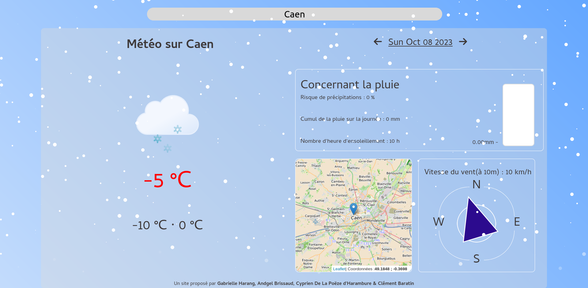

# InstantWeather 🌤️
**La météo, simplement, efficacement.**
Plus qu'une simple App Web, Instant Weather, est la garantie d'un outil précis et conçis. Conçu pour allier simplicité d'utilisation et ergonomie conviviale, Instant Weather peut correspondre au besoin de chacun. 

## Le souci du détail 🔎
### Les thèmes 🖼️
Nous savons à quel point il est sympa de se rendre compte qu'une app s'adapte, à travers différents détails au contexte, nous avons tout fait pour reproduir ce sentiment !
Grâce à nos différents thèmes, variant en fonction de la météo ainsi que de l'heure, InstantWeather s'adapte à l'instant présent. 

Une douce nuit sur InstantWeather

Un hiver froid...

### Une carte 🗺️
Supposons que vous soyez perdu, des choses qui arrivent... Avec InstantWeather et sa carte intégrée, vous savez maintenant où vous vous trouvez. D'une précision fine, la carte sera un atout précieux. 

### Au fait de l'humidité ☔
Le widget seau permet de visualiser intuitivement la quantité d'eau tombée sur une zone donnée. Que ce soit pour jardiner, ou pour savoir comment vous habiller, le widget seau sait être utile dans des cas des plus quotidiens aux plus spécifiques. 

### La boussole 🧭
Philippe Guilhén serait fier, et à juste titre. La boussole est l'outil parfait pour connaître la direction du vent. Simple d'utilisation, la boussole sera vous aiguiller. 
